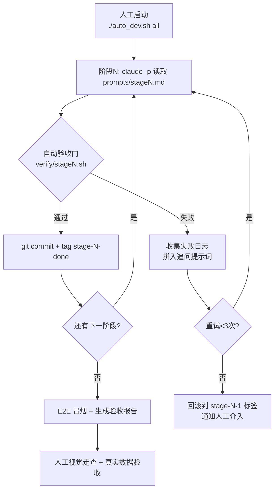

# 智备货 StockWise · 全自动开发方案

> 配套：`CLAUDE.md`（工程约束）、`02_ClaudeCode分阶段提示词.md`（阶段指令）、`mock/`（模拟单据）
> 思路一句话：**把每个阶段提示词交给 Claude Code 无头模式执行，阶段之间用脚本化的"验收门"卡控，过了才进下一阶段，失败自动带错误日志重试，三次不过才叫人。**

---

## 1. 全自动流水线总览



**三个核心机制：**

| 机制 | 说明 |
|---|---|
| 无头执行 | 每阶段用 `claude -p "$(cat prompts/stageN.md)" --dangerously-skip-permissions` 独立会话执行；阶段间无对话上下文，**上下文隔离 = 天然解耦**，阶段质量只由验收门保证 |
| 验收门 | 每阶段配一个 `verify/stageN.sh`：跑 pytest、curl 冒烟、`npm run build`、业务断言 SQL。验收脚本是全自动的前提——**它替代了人工 code review** |
| 失败自愈 | 失败日志（stderr + 失败用例）自动拼成追问提示词重跑；3 次不过 → `git reset` 到上一阶段标签，发通知（邮件/webhook）等人工 |

## 2. 目录与准备（人工只做这一次，约 15 分钟）

```
stockwise/
├── CLAUDE.md                  # 从开发包复制，Claude Code 自动加载
├── prompts/
│   ├── fe_design.md           # 通用前端设计提示词（页面阶段由脚本自动前置拼接）
│   ├── stage0_skeleton.md     # 从 02 文档逐段拆分，一段一文件
│   ├── stage1_datasource.md
│   ├── stage2_engine.md
│   ├── stage3_suggestion.md
│   ├── stage4_alert.md
│   ├── stage5_purchase.md
│   ├── stage6_dashboard.md
│   └── stage7_chat.md
├── verify/                    # 验收门脚本（见第 3 节，随阶段提示词一起给出）
├── mock/                      # 从开发包复制
├── auto_dev.sh                # 编排器（见第 4 节）
└── 01_系统设计.md             # 放入仓库根，提示词中引用
```

人工准备清单：① 装好 Claude Code 并登录；② 把开发包四个部分按上图落位；③ `chmod +x auto_dev.sh verify/*.sh`；④ 跑 `./auto_dev.sh all`。

## 3. 每阶段的自动验收门（verify 脚本设计）

| 阶段 | 验收门关键检查项（脚本化） |
|---|---|
| S0 骨架 | `GET /api/health` 返回 200；`alembic upgrade head` 无错；`python -m app.core.seed --mock` 退出码 0；`npm run build` 通过 |
| S1 数据中心 | 六个 mock CSV 依次 `curl -F file=@mock/xxx.csv /api/import/{source}` 返回成功且写入行数=文件行数-1；重复导入库存表行数不变（幂等）；上传缺列文件返回 400+错误明细；`GET /api/datasources` 返回 6 个源状态 |
| S2 测算引擎 | `pytest tests/test_engine.py` 全过（含 3 个 SKU 手工对拍）；`POST /api/calc/run` 后 `calc_result` 行数=sku_master 行数；抽 SK-2087：forecast_daily 在 [8.7,10.7] 区间、reason_text 非空；SQL 断言注销 trend_modifier 后该系数=1.0 |
| S3 备货建议表 | `GET /api/suggestions` 按评分降序、字段齐全；`PUT /api/suggestions/SK-1023` 改量后再 GET 显示人工值且标"已调整"；导出接口返回 xlsx 且 Content-Type 正确；`npm run build` 通过 |
| S4 预警中心 | 重跑测算后 `GET /api/alerts?type=缺货` ≥3 条且含 SK-2087 紧急级；滞销预警含 SK-0561/SK-8830；再跑一遍预警总数不变（不重复创建）；`PUT /api/settings/rules` 把滞销周转阈值改为 30 天后预警数变多 |
| S5 采购计划 | `POST /api/purchase-orders/generate` 传 3 个 SKU 生成 2 张按供应商分组的草稿；confirm → 在途增加；arrive → 在途减少且库存增加；预算校验：改小预算后重新生成返回 warning 字段；导出 xlsx 200 |
| S6 工作台 | `GET /api/dashboard/summary` 的预警数与 S4 接口实际数一致、待办含"黑五倒计时"；`npm run build` 通过 |
| S7 问答 | 6 类固定问题 `POST /api/chat` 断言：补货清单回答含 Top SKU、断货问题含 SK-2087 与"空运"、滞销问题含 SK-0561、generate_po 类回答后 M5 真的多出草稿；未命中问题返回兜底字段 |
| E2E | 全新环境：seed → 全量导入 → calc/run → 建议/预警/采购/看板/问答 全链路 curl 走一遍，生成 `验收报告.md`（各接口耗时+断言结果汇总） |

> 验收门脚本本身也交给 Claude Code 写：在每个 stageN.md 末尾固定追加一段——"同时编写 verify/stageN.sh，逐项检查：<该阶段验收点>，全部通过退出码 0"。

## 4. 编排器 auto_dev.sh（核心逻辑）

```bash
#!/usr/bin/env bash
set -euo pipefail
STAGES=(stage0_skeleton stage1_datasource stage2_engine stage3_suggestion
        stage4_alert stage5_purchase stage6_dashboard stage7_chat)

run_stage () {
  local name=$1 prompt="prompts/$1.md"
  # 页面类阶段自动前置拼接前端设计约束
  case $name in stage3*|stage4*|stage5*|stage6*|stage7*)
    prompt=$(mktemp); cat prompts/fe_design.md "prompts/$1.md" > $prompt;; esac

  for attempt in 1 2 3; do
    echo "== $name 第 $attempt 次执行 =="
    claude -p "$(cat $prompt)" --dangerously-skip-permissions && \
    bash "verify/$name.sh" && {
      git add -A && git commit -m "$name done" && git tag "$name-done"; return 0; }
    # 失败：把验收日志拼成追问，进入下一轮重试
    claude -p "上一阶段验收失败，日志如下，请修复后重新实现：$(tail -100 verify/last.log)" \
           --dangerously-skip-permissions || true
  done
  git reset --hard HEAD~1 2>/dev/null || true
  echo "$name 三次未过，已回滚，需人工介入" | tee FAILED.flag; exit 1
}

for s in "${STAGES[@]}"; do run_stage "$s"; done
bash verify/e2e.sh   # 全链路冒烟 + 生成验收报告
```

**运行模式：** `all` 全流程无人值守 / `./auto_dev.sh stage4_alert` 单阶段重跑（用于人工介入后续跑）/ `RESUME_FROM=stage5_purchase ./auto_dev.sh all` 断点续跑。

## 5. 全自动 vs 人工的分工

| 环节 | 谁做 | 耗时参考 |
|---|---|---|
| 准备落位 + 启动脚本 | 人工（仅一次） | 15 分钟 |
| S0~S7 逐阶段开发 + 验收门 + 自愈重试 | 全自动 | 6~10 小时（无人值守，可过夜跑） |
| mock 数据的人工放入测试 | 人工（见第 6 节表格，每处 5~10 分钟） | 合计约 1 小时 |
| UI 视觉走查（对照原型图V2 五张图） | 人工 | 30 分钟 |
| 真实业务数据替换 mock 的最终验收 | 人工 | 半天 |

## 6. 模拟数据人工放入测试对照表

| 模拟数据文件 | 放入时机（阶段） | 放入位置 / 操作入口 | 人工测试要点 | 预期观察 |
|---|---|---|---|---|
| sku_master.csv | **S0 完成后** | 命令行：`python -m app.core.seed --mock` 自动导入；或 S1 后在「数据中心」页上传 | 商品档案 8 个 SKU 全部入库，双平台 SKU 平台字段正确 | sku_master 表 8 行 |
| amazon_orders.csv | **S1 验收时** | 数据中心页「亚马逊订单」卡片 → 上传 | 上传成功提示行数；故意改坏一行日期再传，看错误报告 | daily_sales 增加约 696 行；坏行被拒且有明细 |
| walmart_orders.csv | **S1 验收时** | 数据中心页「沃尔玛订单」卡片 → 上传 | 同上；与亚马逊数据互不串台（SKU 平台过滤正确） | daily_sales 再增约 348 行 |
| inventory_snapshot.csv | **S1 验收时** | 「库存报告」卡片 → 上传；**上传后立即重传一次** | 验证幂等：第二次上传不产生重复快照 | inventory_snapshot 始终 8 行 |
| competitor.csv | **S1→S2 之间** | 「竞品情报」卡片 → 上传 | 上传后 SK-1023/SK-4419 的 external_signals 出现 competitor 记录 | 测算时竞争系数生效（reason_text 提及竞品缺货） |
| trends.csv | **S1→S2 之间** | 「行情趋势」卡片 → 上传 | SK-1023（+35%）应映射 1.2 档 | S2 测算后 SK-1023 评分进入 ≥80 档 |
| env_score.csv | **S1→S2 之间** | 「环境评分」卡片 → 上传（或在页面手工录入一次，验证双通道） | 家居家纺 -2 分映射 0.9；**先不传跑一次** S2 验证降级（系数=1.0 且依据注明缺失） | 有无该数据，测算都不报错 |
| promotion_calendar.csv | **S0 seed 时**自动入 settings | 系统设置页可查看/修改 | 把黑五截止日改近（如 09-20），观察 S5 交期倒排文案变化 | PO 生成时提示"海运来不及，建议空运" |
| purchase_orders_history.csv | **S5 验收时** | seed 导入或采购计划页手工补录 | shipped 状态单的 400 件计入 SK-2087 在途；改状态为 arrived 后在途转库存 | S2 重跑后 SK-2087 建议备货量相应减少 |
| 六个 CSV 整体 | **E2E 最终** | 全新环境跑 `verify/e2e.sh` 后，人工在页面上完整走一遍：导入→重新测算→看建议→收预警→生成采购单→问答 | 全流程无断点；各页面数字互相对得上 | 验收报告全绿 |

**人工放入的三条纪律：**
1. **严格按表中的阶段时机放入**——提前放入会绕过对应阶段的验收门（如 S2 之前放 trends.csv，趋势修正器的降级路径就测不到）。
2. 每次放入后必须手动点一次「重新测算」（或调 `POST /api/calc/run`），让影响显式可见。
3. 降级测试（不传某文件）与正常测试成对做，这是可插拔设计的人工验证环节。
