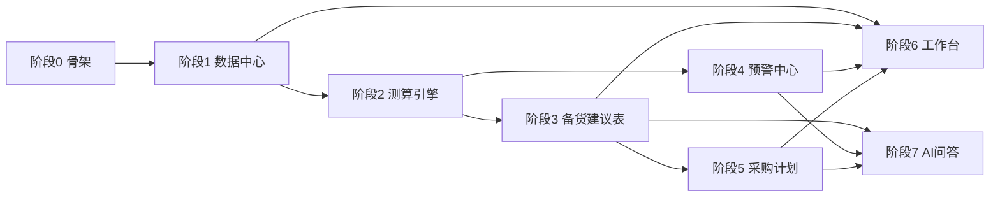

# 智备货 StockWise · Claude Code 分阶段开发提示词

> 使用方式：先通读 `CLAUDE.md` 与 `01_系统设计.md`（Claude Code 会自动加载项目根 CLAUDE.md），然后**按阶段顺序**把下面每个代码块作为一轮提示词输入。每阶段产出可独立运行验证；阶段间仅通过"标准数据表 / 公开 service"耦合，支持按阶段插拔交付。

---

## 通用前端设计提示词（页面类阶段的开头先粘贴本段）

```
【前端设计约束】本项目前端必须严格遵循 CLAUDE.md 第 5 节设计规范，实现前先把 theme.ts
中的设计 token 落地为 Tailwind 配置（colors: bg/card/sidebar/primary/danger/warning/
success/info/ink/sub）。整体布局：左侧 15rem 深色侧边栏（Logo「智备货 StockWise」、
菜单：工作台总览/数据中心/备货建议表/预警中心/采购计划/AI问答助手/系统设置，激活项
#2A2C52 底 + 左缘 4px #6366F1 高亮条），顶部白色栏（页面标题+副标题、搜索框、通知
铃铛带红点、圆形头像），内容区白色圆角 12px 卡片 + #E6E9F2 细描边。组件用
shadcn/ui（Table/Badge/Switch/Progress/Dialog/Toast/Button/Card），图表用 Recharts，
配色只用语义色，禁止自造色值。视觉基准：原型图V2 对应页面截图。
```

---

## 阶段 0：工程骨架（M0）

```
【阶段0 工程骨架】目标：搭好可运行的双进程骨架，为后续所有阶段提供地基。
任务：
1. 按 CLAUDE.md 第 2 节目录结构初始化 backend（FastAPI+SQLAlchemy+Alembic+APScheduler）
   与 frontend（Vite+React+TS+Tailwind+shadcn/ui+Recharts+TanStack Query），前端代理 /api 到 8000。
2. 建全部 9 张表（见 01_系统设计.md 第 3 节），写首个 Alembic 迁移。
3. settings 表预置默认参数：基线权重 0.5/0.3/0.2、四修正器档位、安全天数 10、
   头程海运35天/空运10天、上架5天、预警阈值四项、月采购预算 140000、
   大促日历（黑五 2026-11-27，入仓截止 11-10）。
4. 健康检查 GET /api/health；种子脚本 python -m app.core.seed --mock 把 mock/ 下
   全部 CSV 导入对应标准表。
5. 前端只完成布局壳：侧边栏+顶栏+空路由页面占位，设计规范见 CLAUDE.md 第 5 节。
验收：后端启动建表成功、seed 脚本导入 mock 数据无报错；前端能打开带导航的空壳；
npm run build 通过。
【可插拔说明】本阶段为地基，不可拔；但它不感知任何业务模块，后续模块均以注册方式挂入。
```

---

## 阶段 1：数据中心与数据源适配器（M1，✅ 可插拔）

```
【阶段1 数据中心】目标：把四类散乱数据归集进标准表，提供 CSV 导入 API 与页面。
任务：
1. 实现 datasources/base.py：DataSourceAdapter 抽象类（source_code、fetch(path)->原始行、
   normalize(行)->标准记录、validate(记录)->错误列表）；registry.py 提供
   register()/list()/run(source_code)。
2. 实现 6 个 CSV 适配器（各自独立文件）：amazon_orders、daily_sales 聚合进 daily_sales；
   walmart_orders 同理；inventory → inventory_snapshot；competitor、trends、env_score →
   external_signals（signal_type 分别为 competitor/trend/env）。列映射以 mock/ 下对应
   CSV 表头为准，做表头校验与行级错误报告。
3. 数据校验规则：缺 SKU/日期非法/数值为负 → 该行进错误报告不入库；某 SKU 本期无数据
   → 标记沿用上一期（写 data_flags）。导入幂等：同 source+日期 重复导入覆盖不重复。
4. API：POST /api/import/{source}（multipart 上传）、GET /api/import/logs、
   GET /api/datasources（各数据源上次同步时间与状态）。
5. 前端「数据中心」页：6 张数据源卡片（名称/状态灯/上次时间/上传按钮/最近导入日志），
   上传后 Toast 展示成功行数与错误明细。
验收：用 mock/ 六个 CSV 逐个上传成功；故意上传缺列文件得到明确错误提示；重复上传
不产生重复数据；注销任一适配器（registry 注释掉）后其余适配器与页面正常。
【可插拔说明】本模块完全可插拔：新增数据源=新增适配器文件+注册一行。联动方：M2 测算
引擎读取其产出的标准表；若 M1 整体缺失，M2 仅能基于 sku_master 空跑（降级）。
```

---

## 阶段 2：测算引擎（M2，修正器可插拔）

```
【阶段2 测算引擎】目标：实现每日测算 pipeline，把"拍脑袋"变成透明公式。
任务：
1. engine/pipeline.py：按 SKU 顺序执行 基线日销 → 修正器链 → 预测日销 → 备货评分 →
   建议备货量 → 写 calc_result（含 factors_json、score_detail_json、人话 reason_text）。
2. 基线日销：近30天×0.5+近90天×0.3+去年同期×0.2（缺去年数据转 0.6/0.4；is_stockout_day
   的天数剔除出分母）。权重从 settings 读。
3. engine/modifiers/ 四个修正器，各自独立文件+注册：
   - trend_modifier：读 external_signals(trend) 近30天环比 → 档位映射 1.2/1.1/1.0/0.9
   - competitor_modifier：主要竞品缺货 +0.1、大幅降价 -0.1
   - event_modifier：距大促30~60天且去年大促热销 ×1.3；普通临近 ×1.1
   - env_modifier：人工评分 -2~+2 映射 0.9~1.1
   每个修正器返回 (系数, 人话依据)，依据拼入 reason_text。档位参数全部读 settings。
4. 备货评分：缺货紧迫40（可售天数 vs 备货周期）+销售健康25（近30天趋势与稳定性）
   +外部信号25（四系数综合偏离）+资金效率10（毛利率×周转）。分档 ≥80立即补货/
   60~79常规/40~59观望/<40停止补货。
5. 建议备货量 = 预测日销×(生产+头程+上架+安全天数) − 可售库存 − 在途，负取0，按 MOQ
   向上取整。SKU 参数（lead_prod_days 等）读 sku_master，缺省读 settings 默认值。
6. 提供 POST /api/calc/run 手动触发与 APScheduler 每日 06:30 自动触发（同一入口）。
7. pytest：用 mock 数据对 3 个 SKU 手工验算对拍（基线、系数、评分、备货量逐项断言）；
   注销任一修正器后该 SKU 该项系数=1.0 且 reason_text 注明"该信号缺失"。
验收：POST /api/calc/run 返回成功；calc_result 与手工验算一致；reason_text 可读；
修正器注销降级验证通过。
【可插拔说明】修正器级可插拔。引擎整体与 M1 联动（读 daily_sales/inventory_snapshot/
external_signals/sku_master），被 M3/M4/M6/M7 联动（读 calc_result）。引擎不 import
任何上层模块。
```

---

## 阶段 3：备货建议表（M3，🔗 联动 M2）

```
【阶段3 备货建议表】先粘贴【通用前端设计约束】。
目标：核心决策页，让运营一行看懂"备不备、备多少、为什么"。
任务：
1. API：GET /api/suggestions（筛选：platform/score_band/status；按评分降序），每行返回
   SKU/平台/分仓库存/在途/预测日销/可售天数/建议备货量/评分/评分依据/reason_text；
   PUT /api/suggestions/{sku}（人工改量或忽略，写 suggestion_override，列表优先显示
   人工值并标"已调整"）；GET /api/suggestions/export 导出 xlsx。
2. 前端页：筛选条（平台/类目/评分/状态下拉 + 搜索 + [重新测算]主按钮 + [导出Excel]）；
   表格行内：评分用 Badge 按分档着色（≥80红/60~79橙/40~59灰/<40蓝），可售天数<15天
   红色加粗，操作列[生成采购][忽略]；点击行展开 Drawer 显示评分依据：四个维度各一条
   Progress 条（得分/满分+维度名）+ reason_text 全文 + 建议量计算公式代入过程。
3. [重新测算] 调 POST /api/calc/run 后自动刷新列表并 Toast 完成时间。
验收：页面与 原型图V2/02 视觉一致；筛选/导出/人工调整生效且刷新后保留；Drawer 中
数字与 calc_result 一致。
【联动说明】只读 calc_result + 写 suggestion_override；[生成采购] 跳转 M5 并携带勾选
SKU 列表（M5 未交付时该按钮隐藏）。不感知引擎内部逻辑。
```

---

## 阶段 4：预警中心（M4，规则可插拔）

```
【阶段4 预警中心】先粘贴【通用前端设计约束】。
目标：测算完成后自动扫描规则，分级预警并通知，形成处理闭环。
任务：
1. alerts/registry.py 装饰器 @register_rule(code, default_level)；实现 4 条内置规则，
   阈值全部读 settings：缺货紧急（可售天数<头程）、缺货一般（<头程+安全）、滞销严重
   （周转>120天或库龄>180天）、滞销轻度（周转>60天）。每条规则产出 title/detail/advice
   （advice 带具体数字，如"立即采购450件，建议改空运"）。
2. 规则扫描挂在测算 pipeline 之后；同一 SKU 同 code 未处理的预警不重复创建。
3. alerts/notifier/：Notifier 接口 + 两个实现 站内信（写 alert 即站内）与邮件（SMTP，
   紧急级实时、一般/滞销按 settings 汇总周期）；发送结果写 alert.notify_log；SMTP 未配置
   时降级仅站内并记日志。
4. API：GET /api/alerts（type/level/status 筛选）、PUT /api/alerts/{id}（已处理/已忽略）、
   GET/PUT /api/settings/rules（阈值与开关读写）。
5. 前端页：顶部 Tab 徽章（缺货5/滞销8/全部）；预警卡片左缘 4px 语义色条 + 分级 Badge
   + 原因 + 建议 + 动作按钮（缺货→[生成采购单]跳 M5；滞销→[创建促销建议]占位）；底部
   规则配置区：每行 规则名/触发条件/通知方式/Switch 开关，[编辑规则]弹 Dialog 改阈值。
验收：用 mock 数据跑出 5 条缺货+8 条滞销（数量以 mock 实际为准）；阈值改小后重跑
预警数变化；重复扫描不产生重复预警；注销任一规则不影响其余。
【可插拔说明】规则与通知器两级可插拔。联动：读 calc_result（M2）、[生成采购单]跳 M5。
```

---

## 阶段 5：采购计划（M5，🔗 联动 M3/M1）

```
【阶段5 采购计划】先粘贴【通用前端设计约束】。
目标：把确认过的备货建议汇总成可执行采购单，管预算、倒排交期、跟踪到货。
任务：
1. POST /api/purchase-orders/generate：入参勾选 SKU 列表 → 按 (supplier, dest_warehouse)
   分组生成草稿单（po_no=PO-日期-序号，items_json 含 SKU/数量(优先人工调整值)/单价/金额），
   同一供应商同一目的仓合并。
2. 校验：合计金额超月预算 → 返回 warning 字段（不拦截）；交期倒排：对 settings 大促日历
   中未来最近的大促，若 入仓截止−今天 < 头程+上架 → items 标记 suggest_air=true 并给
   提示文案（海运最迟下单日/空运最迟下单日各算一个）。
3. 状态机：draft→confirmed→shipped→arrived；confirmed 时把数量写入对应 SKU 在途
   （inventory_snapshot.in_transit_qty 当日快照增量），arrived 时冲减在途、增加可售库存。
4. API：GET 列表（状态/供应商筛选）、PUT /{id}/confirm、/{id}/ship、/{id}/arrive、
   DELETE（仅 draft）、GET /{id}/export 导出 xlsx 采购单。
5. 前端页：筛选条+[从建议生成]主按钮（跳 M3 带勾选回传或弹选择 Dialog）；采购单卡片
   左缘 Indigo 色条、状态 Badge（待确认橙/紧急红/已确认绿）、明细表格、卡片底部
   小计+毛利估算+[确认下单][调整数量][删除]；页面底部汇总卡：单数/总金额/月预算
   Progress 条（占用%）+ 交期倒排提醒文案。
验收：从 M3 勾选 3 个 SKU 能生成 2 张按供应商分组的草稿；预算进度条与倒排文案正确；
confirmed→shipped→arrived 后在途与库存数字联动正确；导出的 xlsx 可发供应商。
【联动说明】读 M3 确认的建议（联动 M3），回写 M1 的库存快照（联动 M1）；被 M6 聚合、
M7 问答引用。单据状态机独立，上游缺失时可手工新建草稿（降级）。
```

---

## 阶段 6：工作台总览（M6，🔗 聚合只读）

```
【阶段6 工作台总览】先粘贴【通用前端设计约束】。
目标：一页看清"现在有多少事要办、数据新不新鲜"。
任务：
1. GET /api/dashboard/summary 聚合：在售SKU数、建议备货SKU数、缺货/滞销预警数（含紧急数）、
   各数据源上次同步时间与状态、近30天双平台日销序列、待办列表（紧急缺货Top、数据未更新
   提醒、待确认采购单及金额、最近大促倒计时与海运最迟下单日）。
2. 前端页：4 张 KPI 卡（彩色方块图标+大数字+环比/状态文案）；左侧"全店销量趋势"
   Recharts 双折线面积图（亚马逊/沃尔玛图例徽章）；右侧"数据接入状态"列表（状态灯+
   上次时间+已连接/待更新 Badge）；底部"今日待办"列表（左色条+类型 Badge+文案+
   [去处理]跳转对应模块）。
验收：各数字与 M3/M4/M5 页面实际一致；点击待办正确跳转；趋势图与 daily_sales 一致。
【联动说明】纯聚合只读，联动 M1/M2/M4/M5 的公开统计接口；任一模块缺失时对应卡片显示
"未启用"而不报错。
```

---

## 阶段 7：AI 问答助手（M7，🔗 联动 M2/M3/M4/M5）

```
【阶段7 AI问答助手】先粘贴【通用前端设计约束】。
目标：Workbuddy 风格对话入口，用自然语言查备货结论、看依据、直接触发动作。
任务：
1. 后端 POST /api/chat：规则化意图识别（MVP 不上大模型）：关键词路由到 6 类 handler——
   本周补货清单（读 calc_result Top）、单SKU断货预测（可售天数+建议量+空运/海运两案）、
   滞销原因（读 alert+评分依据）、大促排期（交期倒排计算）、生成采购计划（调 M5
   generate 返回草稿）、预算查询（读 M5 汇总）。每类 handler 返回
   {answer_md, data_chips[], actions[]}；actions 仅两种：link(跳转页) 与
   generate_po(调采购单接口)。回答末尾固定附"数据来自今日 HH:MM 测算，仅供参考"。
2. 未命中意图 → 返回兜底话术+建议问题列表。
3. 前端页（Workbuddy 布局）：左侧窄栏[+新对话]+最近对话列表（localStorage 存会话）；
   主区居中欢迎语"你好，{用户}。今天想了解什么备货问题？"+数据时间副标题；2×2 建议
   问题卡片（点击即发送）；对话气泡：用户右侧 Indigo 圆角气泡+头像，AI 左侧白色卡片
   （data_chips 渲染为彩色 Badge 行，actions 渲染为按钮）；底部圆角输入框+[全平台▾]
   [深度分析]两个 Chip+圆形发送按钮。
4. actions 点击：link 跳路由；generate_po 调接口成功后 Toast 并给"去采购计划查看"。
验收：6 类示例问题各有正确回答（数据与对应页面一致）；data_chips/actions 渲染正确；
generate_po 真能在 M5 看到草稿；未命中问题有兜底。
【联动说明】本模块是各域的"对话皮肤"：只调 M2~M5 公开 service/API，不复制任何业务
逻辑；新增意图=新增一个 handler 注册。MVP 不接 LLM，后续可在 handler 层平滑替换为
模型调用（接口不变）。
```

---

## 阶段顺序与依赖图



- 并行机会：S3 与 S4 可并行；S6 纯聚合可放最后；S7 仅依赖各域只读接口，可提前用 mock 响应开发前端。
- 3 天压缩版：只做 S0→S1→S2→S3→S5（S4 降级为建议表内"可售天数标红"，S6/S7 进 V1.1）。
